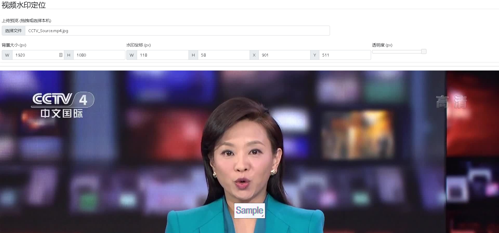

# ffmpeg-watermark-position-extraction-tools

FFmpeg Watermark Position Extraction Tools          
一个定位视频水印位置的GUI工具            
本工具解决的问题就是不在需要使用其他工具(例如photoshop)来寻找水印的坐标       
本应用为单页应用,依赖的资源都调用了外部CDN         

>所有测试源文件都在test目录下       

### 1. 演示 Demo

 - https://www.ffmpegtoolkit.com/ffmpeg-watermark-position-extraction-tools/

### 2. 使用 Using

1. 首先生成帧图

```shell

INFILE=CCTV_Source.mp4
ffmpeg -hide_banner -ss 3 -y -i "${INFILE}" -f image2 -vframes 1 ${INFILE}.jpg

# 获得 CCTV_Source.mp4.jpg
```


2. 上传截图
把这个视频截图拖拽或者上传至本页     
会显示出图片,中间会显示一个水印的样本区域 (该区域可以拉拽着改变大小)    
拖拽至覆盖视频截图的水印    


3. 生成命令
底部 Command 控制命令会生成命令    
生成的命令仅截取视频15秒的内容进行预览,观察,
```shell

# 运行ffmpeg去除水印
INFILE=CCTV_Source.mp4; #修改源视频文件名
ffmpeg -hide_banner -loglevel error -y -i ${INFILE} -vf delogo=x=120:y=78:w=246:h=105:show=0 -t 15 1627970211670.mp4

# 再次截图对比
INFILE=1627970211670.mp4
ffmpeg -hide_banner -ss 3 -y -i "${INFILE}" -f image2 -vframes 1 ${INFILE}.jpg

```

4. 观察效果
>执行后 去掉水印的效果

| 原视频有水印 | 新视频去水印 |
|--|--|
|  |  |


### 3 授权 License
 - Apache License 2
